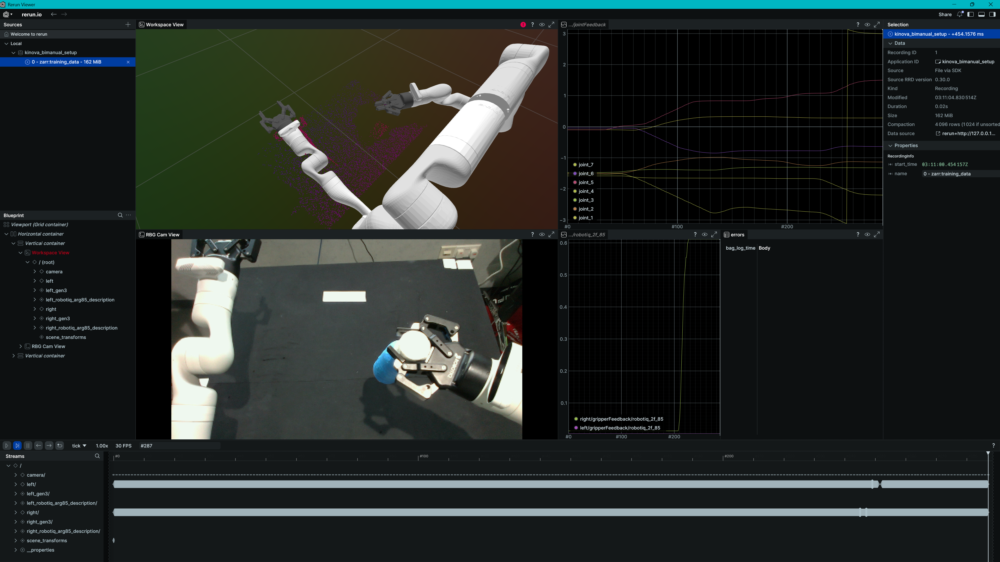
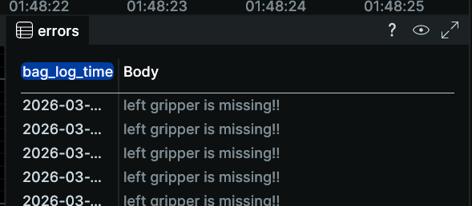
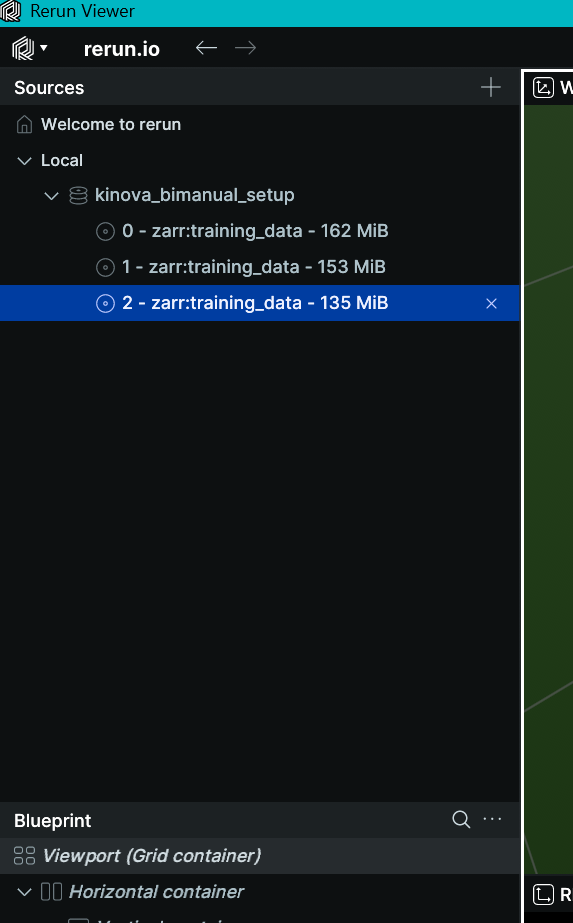
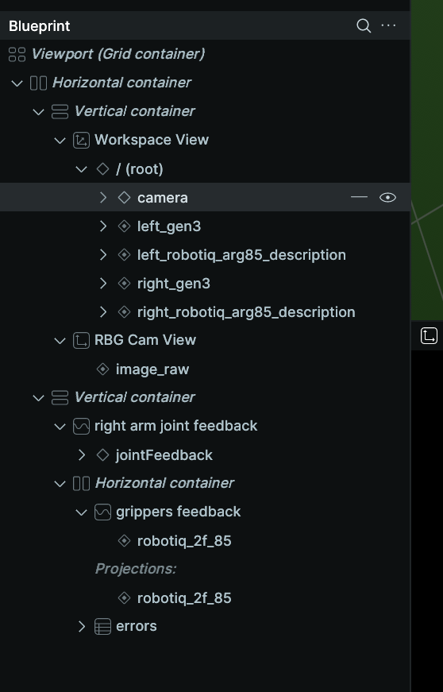
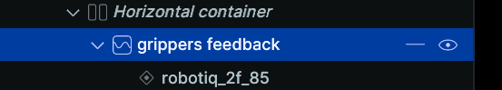
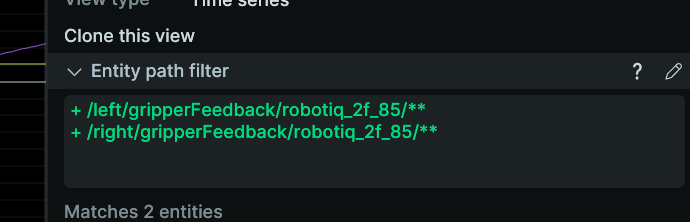
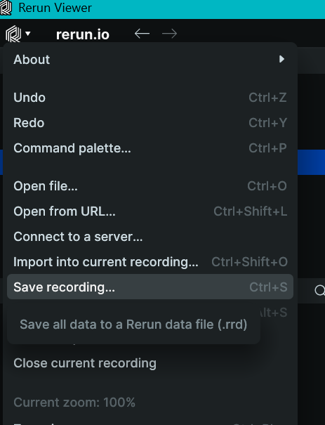

# data visualiser
a python script to visualise rosbag2 and zarr files with rerun.

# usage guide

## Building the docker container
in the ```htx_visualisation``` folder run ```docker build -t rerun:0.30.0 .```  
(alternatively if you dont want to be in a container you can create a venv with the `visualisation/requirements.txt`) 

## Running the visualiser
1. Edit the ```./run_visualiser.sh``` file to change the data volume mount location to where your data is. (hint: 2nd last line)
2. Edit the ```config.yaml``` if needed (mostly look at the zarr and rosbag data dir) ([see here](#config-file-parameters))
3. In the ```htx_visualisation``` folder run ```./run_visualiser.sh``` to launch the REPL
4. type `help` to get help
5. type `quit` to quit

## REPL guide
there are 2 main rendering commands, `zarr` and `rosbag`. 
- they require you to provide the folder which contains your episodes, and in the case of `rosbag`, the spesific episode to start from.
- in general, typing them without providing a needed argument will make them print the possible files for the argument. 
- when passing a argument value, you can either pass the name of the folder itself, or the idx of the folder.  
- for rosbags, idx == episodes
- autocomplete is avaliable, type `tab` while typing.
- example usages
    - `rosbag` -> prints all datasets avaliable in the rosbag folder, and their idx
        - example output:
            ``` powershell
            > rosbag
            usage: rosbag <foldername | idx> <bagfilename | episode_number>. Avaliable folders are:
                    idx:    foldername
                    0:      group_one
            ```
    - `rosbag 0` -> prints all episodes in the 1st dataset
        - example output:
            ``` powershell
            > rosbag 0
                    idx:    size:   foldername
                    0       3.63GB  B-KING37-RQ2F85-L515-R-L_TBLTP_P_BLUBTL-LOC4_2026-02-26-18-11-11_S
                    1       3.74GB  BJS-KING37-RQ2F85-L515-R-L_TBLTP_PNP_START-BLUBTL-BLUEBOX-LOCR_2026-03-13-01-48-17_S
            usage: rosbag <foldername | idx> <bagfilename | episode_number>. Avaliable bagfiles above:

            ``` 
    - `rosbag group_one 1` -> render the dataset group_one, episode 2
    - `rosbag 0 B-KING37-RQ2F85-L515-R-L_TBLTP_P_BLUBTL-LOC4_2026-02-26-18-11-11_S` -> render the first dataset, and that spesific episode (episode 1)
    - `zarr training_data 6` -> render dataset training_data, episode 7

there are 2 commands that allow you to quickly render the next/previous episodes, `n` and `p`
- they only work after one of the main rendering commands are called
- if you go out of bounds it will just render the earliest/latest episode instead

there are 3 utility commands that print metadata, `info_zarr`, `info_rosbag` and `info_config`.
- `info_zarr` prints the meta tree of the zarr folder
- `info_rosbag` prints the list of bagfiles in the folder / `metadata.yaml` of the bagfile
- `info_config` prints the current `config.yaml` you are using

further usage infomation can be seen by typing `help <command>` in the REPL.  

## Rerun guide
after rendering a episode, you will see the following:  
  
- top left window shows the recordings loaded into rerun 
- middle left window manages visualisation view settings 
- main visualiser showed in the middle group of windows 
- timeline and play/stop buttons on the bottom window 
- logged points' entitiy paths on the bottom left window  
- settings and configs on the right window 

point to note:
- the "errors" window will tell you that the rosbag does not have gripper feedback infomation in their joint states topic
  

### how to guides
#### how to go back to a old recording that was loaded  
-   
- the nameing of each recording is as follows  
    - {episode number} - {filetype}:{name of folder}
- just click on the one you want to see

#### how to change whats visible on the visualisation
- to hide temporarily,   
    -     
    - click the eye button next to the thing you want to hide
- to add something that isnt visible / remove something from a view,
    -  
    - select the view from the middle left panel
    -  
    - on the right panel, edit the enitity path
        - \+ to add
        - \- to remove
        -** to select all children

#### how to save my new pretty layout so that it automatically loads everytime
- after editing your layout, you need to save the blueprint file (.rbl) which saves the format.
-    
- click that to save the .rbl
- edit the [config file](#config-file-parameters)'s `blueprint_path` parameter
- (if your running in a container be sure to rebuild / mount the new file)

# development guide
## config file parameters
`zarr_dir`: path from ./visusalisation to directory containing zarr files \
`rosbag_dir`: path from ./visusalisation to directory containing rosbag files \
`rosbag_type`: the extenstion of the rosbag file. ".db3" for example 

`print_times`: whether to print debugging info about the amount of time logging took \
`arm_dof`: number of joints in the arm. used to distinguish gripper from arm 

-- this section is only used when using processing zarr files --  \
`times_name`: name of the timeline   \
`joint_names`: an array consiting of the joint names + gripper name. used to find arm joints in urdf, as well as to define entitiy paths for each arm joint as well as gripper  \
-- section end --
 
`scene_path`: path from ./visusalisation to yaml decribing the transform of the arm n camera  \
`urdf_path`: path from ./visusalisation to arm urdf  \
`gripper_urdf_path`: path from ./visusalisation to gripper urdf  \
`blueprint_path`: path from ./visusalisation to blueprint file (.rbl)  \
`application_id`: name of the application id rerun uses to group similar recordings.

`point_radii`: size of the points of the pointcloud in m  \
`point_colorscheme`: color scheme of the points. `mono` makes it all green, `heatmap` makes it blue to red based on z height 

## supported files
### rosbags 
supports the following topics
- /camera/color/image_raw (sensor_msgs/msg/image)
- /camera/depth/color/points (sensor_msgs/msg/pointcloud2)
- /left_arm/arm_feedback (sensor_msgs/msg/jointstate)
- /right_arm/arm_feedback (sensor_msgs/msg/jointstate)
uses bagger log time as the timeline
uses row by row logging (instead of zarr's columnlar logging) so a little slower  

to add a new topic, just add on to the if else block in the end of render() 

### zarr files
must follow anzac's convertor's format  
~ denotes number of episodes  
```
/
├── data
│   ├── action (~, 12) float32
│   ├── img (~, {height}, {width}, 3) uint8
│   ├── point_cloud (~, {points}, 6) float32
│   └── state (~, 12) float32
└── meta
  └── episode_ends (~,) int64
```  
where  
- action = [left_arm, right_arm, left_gripper, right_gripper]
- img = [r,g,b]
- point_cloud = [x,y,z, r,g,b]
- state = [left_arm, right_arm, left_gripper, right_gripper]

uses a tick based timeline ie. it assumes equal time between each frame  
uses columlar logging ie. sends ALL points of one type (eg. images) together.  
all the exact numbers above ie. not ~, {height}, {width} are hardcoded in the script

## assumptions 
- joints are in order ie. joint_1, joint_2, ..., gripper for rosbags. 
- for rosbags, joint names for left and right arms are identical
- for rosbags, i will definately receive all joints of the arm in the joint sensor message
    - it can deal with missing gripper, but not missing arm joints
- zarr will follow exactly the format spesified

## directory of files
`repl.py` --> user interface to render files. calls `render_rosbag.py` and `render_zarr.py` accordingly. Feeds a dictonary of config paramters to each script.  

`render_rosbag.py` renders rosbags. 
- `render(configs)`
    - main rendering function
    - takes in the following items in the dictionary:
        - `bagpath`
        - `print_times`
        - `scene_path`
        - `urdf_path`
        - `gripper_urdf_path`
        - `point_radii`
        - `point_colorscheme`
        - `dof`
- `convertPointCloud(msg, colorscheme)`
    - converts a ros2 PointCloud2 message into a np array with shape (height, width, 3), and a np array of colors with shape (height, width, 3) if colorscheme == heatmap
- `logArmTransform(tree_joints, msg, prefix, dof)`
    - reads a ros2 JointState message, compute transforms based on urdf, and log transforms + raw joint feedback into rr
- `getMetadataFromBag(bagpath, typestore, dof)`
    - scans through the bagfile for the following infomation.
        - `startTime`
        - `jointNames`
        - `gripperName`
        - `imageSize`
    - will break once all info is found, but conversely means will scan through the whole bag file if a peice of infomation is missing
    - this infomation is used by other functions in render()


`render_zarr.py` renders zarrs. 
- `render(configs)`
    - main rendering function
    - takes in the following items in the dictionary:
        - `bagpath`
        - `print_times`
        - `scene_path`
        - `urdf_path`
        - `gripper_urdf_path`
        - `point_radii`
        - `point_colorscheme`
        - `dof`
        - `times_name`
        - `joint_names`
        - `episode_select`
- `unpackTransformObject(tf)`
    - takes in a rerun transform object and unpacks into its components as a dictionary of python arrays
- `getEpisodeRange(file, episode_select)`
    - converts the episode range into start and end frame indicies


`helpers.py` contains various utility functions used by render scripts. 
- `sceneSetup(urdf_path_dict, scene_path)` 
    - logs the initial transforms to get the arm and camera into position
- `createHeatMap(heights, min, max)`
    - takes in a np array of heights and spits out a np array of rgb values based on height
    - goes red to blue
- `processUrdf(urdf_data)`
    - takes in a dict with the following keys
        - `urdf_paths` lsit of urdf file paths eg. (arm.urdf, gripper.urdf)
        - `urdf_names` list of names to call the urdfs given above
        - `driving_joints` list of driving joints for each urdf (if passing a single string it will auto search for mimic joints of that single string)
        - `prefix_names` list of prefixes to append to each urdf, eg. (left, right)
    - will create a new urdf for each prefix prepended to all the joint names, for each urdf
        - this is because when logging a urdf to rerun, rerun automatically uses the joint name as the joint frame, so to diff between left and right arm frames, the joint name needs to change
    - returns the new urdf path names, as well as the rerun utilities tree objects of the urdf

## entity paths
rerun paths where each sensor is logged.  
**URDFS** \
left arm: left_gen3 \
right arm: right_gen3 \
left gripper: left_robotiq_arg85_description \
right gripper: right_robotiq_arg85_description

**URDF Transforms** \
left arm+gripper: left/transforms \
right arm+gripper: right/transforms
                                             
**Joint Feedback (state)** \
left arm: left/jointFeedback/joint_{jointnumber} \
right arm: right/jointFeedback/joint_{jointnumber} \
left gripper: left/gripperFeedback/{grippername} \
right gripper: right/gripperFeedback/{grippername}

**Joint Targets (actions)** \
not implemented

**Camera** \
rgb camera: /camera/color/image_raw \
depth camera: /camera/depth/color/points

**Scene set up** \
transformations: /scene_transforms

**Timeline**
rosbags: bag_log_time \
zarr: {times_name}